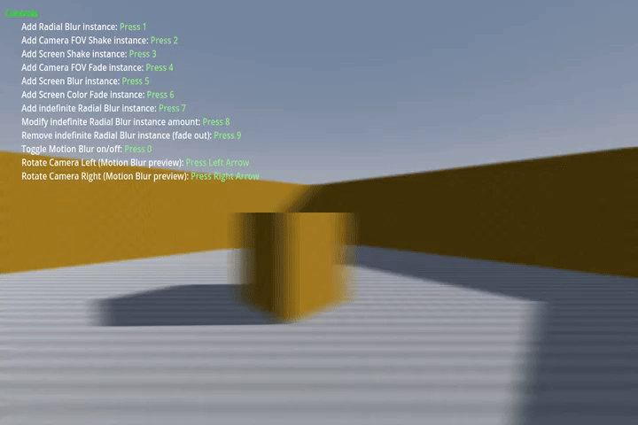

# Full Screen Effects Addon for Godot 4

This Full Screen Effects addon is created specifically for 3D projects. It includes a variety of full-screen effects, supports multiple instances for each effect, and features a smooth fade system for seamless transitions. An example project is included to help you get up and running quickly.

Please note: this addon is provided as-is. While there won't be official support, I will be updating and fixing it as I continue work on my own project.



## Features

- **Full Screen Effects:**
  - Radial Blur
  - Screen Blur
  - FOV Shake
  - FOV Fade
  - Screen Shake
  - Fade from/to Color
  - Motion Blur
- **Multiple Instances:** 
  Multiple instances of each effect can be added and controlled individually.
- **Effect Management:**
  Built-in system to handle the fade-in, fade-out, and duration of each effect.
- **Example Project:**
  Includes a sample project demonstrating the usage of the addon.

## Installation

The installation process follows the standard procedure for any Godot addon:

1. Download the latest version of the addon.
2. Extract the addon and copy the `addons/ScreenEffects` folder into the root directory of your Godot project.
3. Navigate to **Project > Project Settings > Plugins**. Locate the "Full Screen Effects" plugin and set it to **Active**.
The addon should now be available for use in your project.

## Usage

The addon provides an easy-to-use API to add and manage full-screen effects. Here's an example using the **Radial Blur** effect.

### Example: Adding a Radial Blur Effect

To add a radial blur effect instance, use the following function call:

```gdscript
# Adds a single instance of Radial Blur effect with an amount of 1.25, 
# fade-in of 1.0 second, duration of 1.0 second, 
# and fade-out of 3.0 seconds.

ScreenEffects.AddRadialBlur(1.25, 1.0, 1.0, 3.0)
```

### Manipulating Effect Instances

You can store the ID of an effect instance to manipulate it later. If the duration is set to -1, the effect will continue indefinitely until manually stopped.

```gdscript
var mlRadialBlurInstanceID: int = -1

###################################################
# Add a Radial Blur effect with no fade-out (runs indefinitely).
if mlRadialBlurInstanceID == -1:
    mlRadialBlurInstanceID = ScreenEffects.AddRadialBlur(1.25, 1.0, -1.0, 3.0)

####################################################
# Update the amount of the Radial Blur effect to 0.5.
if mlRadialBlurInstanceID != -1:
    ScreenEffects.SetRadialBlurAmount(mlRadialBlurInstanceID, 0.5)

#####################################################
# Stop the Radial Blur effect and reset the ID.
if mlRadialBlurInstanceID != -1:
    ScreenEffects.StopRadialBlur(mlRadialBlurInstanceID)
    mlRadialBlurInstanceID = -1

```

### Roadmap

More effect types will be added in future updates.

### Example Project

An example project demonstrating the usage of this addon is included in the repository. Check the example_project/ folder for a working setup that shows how to integrate and manage the effects in your own project.

### License
This addon is licensed under the MIT License. See the LICENSE file for more information.
